

  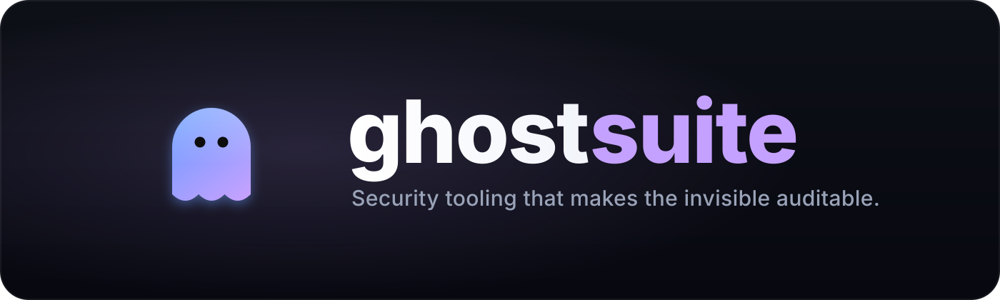

  Eleven open-source security tools, one ghost. Production command-line tools spanning offensive, defensive, supply-chain, cloud, and cryptographic security. Each is installable, test-covered, and green on CI.

  
  
  
  

---

## The suite

<table>
  <tr>
    <td align="center" width="33%" valign="top"><a href="https://github.com/joemunene-by/ghostrecon">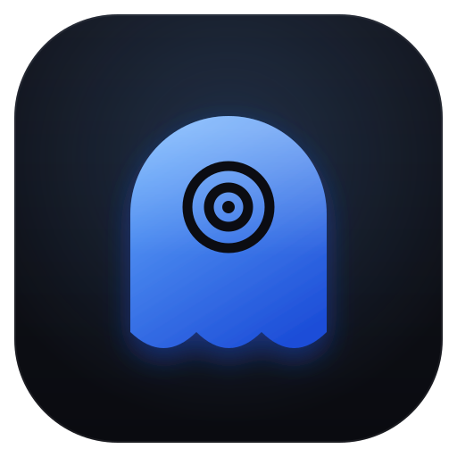 <b>ghostrecon</b></a> Passive OSINT recon framework</td>
    <td align="center" width="33%" valign="top"><a href="https://github.com/joemunene-by/ghostmap">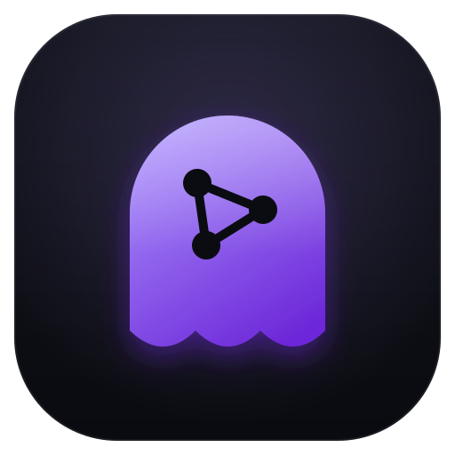 <b>ghostmap</b></a> Web vulnerability scanner (XSS, SQLi)</td>
    <td align="center" width="33%" valign="top"><a href="https://github.com/joemunene-by/ghostpwn">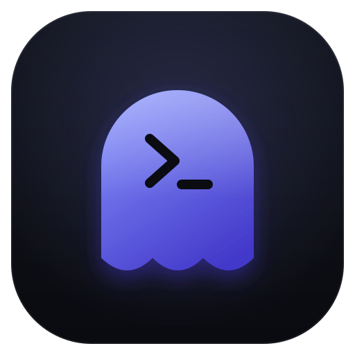 <b>ghostpwn</b></a> Pentest workflow orchestration</td>
  </tr>
  <tr>
    <td align="center" width="33%" valign="top"><a href="https://github.com/joemunene-by/ghostscope">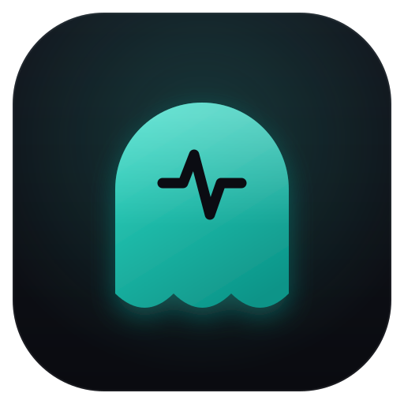 <b>ghostscope</b></a> AI-based intrusion detection</td>
    <td align="center" width="33%" valign="top"><a href="https://github.com/joemunene-by/ghostbox">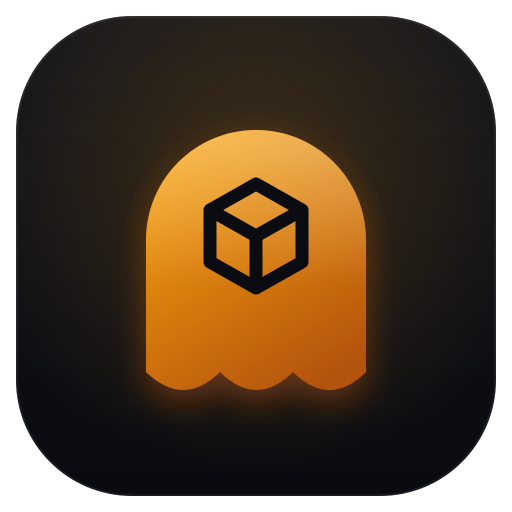 <b>ghostbox</b></a> Static malware analysis sandbox</td>
    <td align="center" width="33%" valign="top"><a href="https://github.com/joemunene-by/ghostdlp">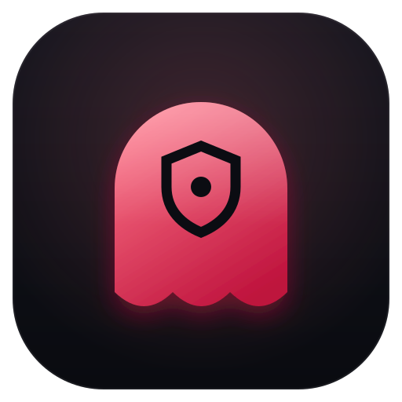 <b>ghostdlp</b></a> Data-leak prevention and PII classifier</td>
  </tr>
  <tr>
    <td align="center" width="33%" valign="top"><a href="https://github.com/joemunene-by/ghostsbom">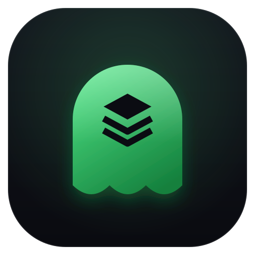 <b>ghostsbom</b></a> Software supply-chain analyzer</td>
    <td align="center" width="33%" valign="top"><a href="https://github.com/joemunene-by/ghostchain">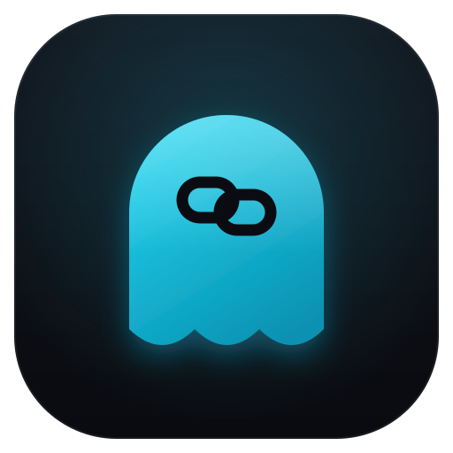 <b>ghostchain</b></a> Solidity smart-contract auditor</td>
    <td align="center" width="33%" valign="top"><a href="https://github.com/joemunene-by/ghostmobile">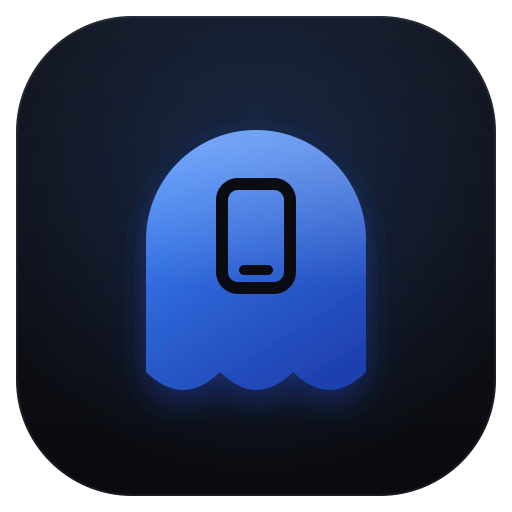 <b>ghostmobile</b></a> APK and IPA static analyzer</td>
  </tr>
  <tr>
    <td align="center" width="33%" valign="top"><a href="https://github.com/joemunene-by/ghostcloud">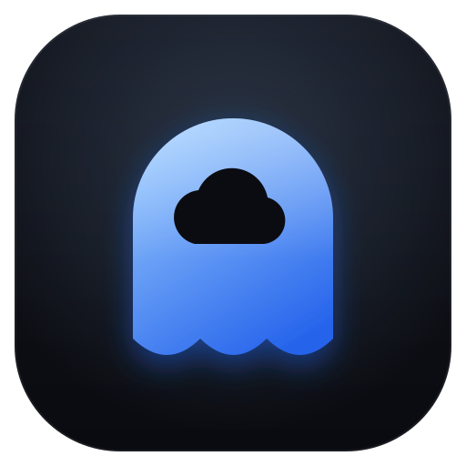 <b>ghostcloud</b></a> Multi-cloud posture (CSPM) scanner</td>
    <td align="center" width="33%" valign="top"><a href="https://github.com/joemunene-by/ghostvault">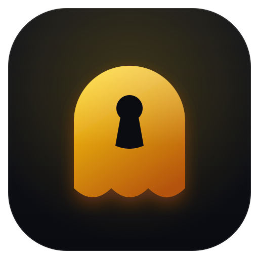 <b>ghostvault</b></a> Key management system (KMS)</td>
  </tr>
</table>

## One system, eleven tools

The suite shares more than a prefix. Every tool is built to the same standard: a Typer command-line interface, structured output to console, JSON, and SARIF for CI gating, real test coverage, GitHub Actions CI across Python 3.11 and 3.12, and an authorized-use posture by default. The visual identity is generated from a single design system, one ghost mark, one accent and one glyph per tool, so the family reads as one product line.

The throughline is the theme: security and safety are about what you cannot see directly, the adversary already inside the system, the failure that has not surfaced yet. These tools exist to make the invisible auditable.

## The broader ghost ecosystem

The suite sits alongside the rest of the work under the same name:

- **[GhostLM](https://github.com/joemunene-by/GhostLM)** is an 81M-parameter cybersecurity language model trained from scratch in PyTorch.
- **[ghostloop](https://github.com/joemunene-by/ghostloop)** is a fail-closed safety runtime for embodied agents, published on PyPI.
- **[ghostforensics](https://github.com/joemunene-by/ghostforensics)**, **[ghostsiem](https://github.com/joemunene-by/ghostsiem)**, **[ghostaudit](https://github.com/joemunene-by/ghostaudit)**, and **[ghostguard](https://github.com/joemunene-by/ghostguard)** round out the defensive and agent-safety tooling.

## Authorized use

These are tools for authorized security work: assessments you are permitted to run, systems you own or have written permission to test, and defensive monitoring of your own infrastructure. Use them lawfully and with consent.

## License

MIT. Each tool is independently licensed in its own repository.

---

  Built by <a href="https://github.com/joemunene-by">Joe Munene</a>, founder of <a href="https://github.com/complexdevelopers">Complex Developers</a>.

